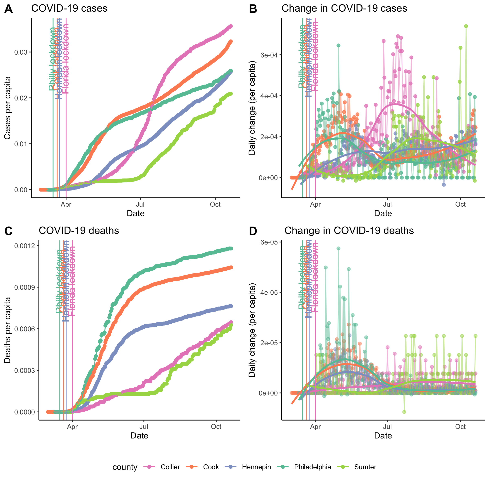
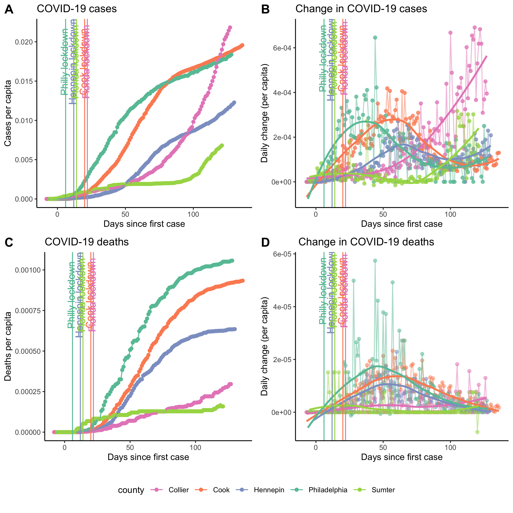

## COVID-19 daily progression

Data for all US counties are pulled daily from the nytimes github repository: https://github.com/nytimes/covid-19-data. 
Below, I plot the daily progression of cases per capita and the daily change in cases per capita for the following counties:  
1. Philly (me)  
2. Cook (Ben)  
3. Hennepin (Sydney)  
4. Collier (Mom and Larry)  
5. Sumter (Bonnie's parents)  

```{r setup, include=FALSE, warning=FALSE}
library(tidyverse)
library(cowplot)
library(lubridate)
library(gganimate)
library(gifski)
library(png)
theme_set(theme_classic(base_size = 10))
setwd('/Users/larsenb/Documents/BenProjects/covid19/')
```


```{r prepare data, echo=FALSE}
covid_data <- read.csv('/Users/larsenb/Documents/BenProjects/covid19/covid-19-data/us-counties.csv')
covid_data$date<-as.Date(covid_data$date)

covid_data <- covid_data %>%
  filter(!(county=="Cook" & state != "Illinois")) %>% 
  filter(!(county == "Sumter"&state != "Florida")) %>%
  filter(county %in% c("Philadelphia","Cook","Hennepin","Collier","Sumter")) %>%
  filter(date > as.Date("2020-02-29"))

cook_population <- 5211000
philly_population <- 1581000
hennepin_population <- 1252000
collier_population <- 372345
sumter_population <- 132985

covid_data$population[covid_data$county == "Cook"] <- cook_population
covid_data$population[covid_data$county == "Philadelphia"] <- philly_population
covid_data$population[covid_data$county == "Hennepin"] <- hennepin_population
covid_data$population[covid_data$county == "Collier"] <- collier_population
covid_data$population[covid_data$county == "Sumter"] <- sumter_population

covid_data <- covid_data %>%
  mutate(cases_per_capita = cases/population) %>%
  mutate(deaths_per_capita = deaths/population)
  

philly_lockdown <- as.Date("2020-03-16")
cook_lockdown <- as.Date("2020-03-21")
hennepin_lockdown <- as.Date("2020-03-24")
florida_lockdown <- as.Date("2020-04-01")

drv <- function(x) c(NA, diff(x))
first_date <- function(x,y) min(x[y==min(y)],na.rm=T)

covid_data <- covid_data %>%
  group_by(county) %>%
  mutate(daily_change = drv(cases_per_capita)) %>%
  mutate(daily_change_deaths = drv(deaths_per_capita)) %>%
  mutate(days_since_first_case = as.numeric(date - first_date(date,cases)))

d1s <- covid_data %>% summarise(mind = min(date))
philly_lockdown_days <- as.numeric(philly_lockdown - d1s$mind[d1s$county=="Philadelphia"])
cook_lockdown_days <- as.numeric(cook_lockdown - d1s$mind[d1s$county=="Cook"])
hennepin_lockdown_days <- as.numeric(hennepin_lockdown - d1s$mind[d1s$county=="Hennepin"])
collier_lockdown_days <- as.numeric(florida_lockdown - d1s$mind[d1s$county=="Collier"])
sumter_lockdown_days <- as.numeric(florida_lockdown - d1s$mind[d1s$county=="Sumter"])

recent_date = max(covid_data$date)
cat(sprintf("\nMost recent data: %s\n",recent_date))
```

```{r plots, warning=FALSE,echo=FALSE}
philly_color = "#66c2a5"
cook_color = "#fc8d62"
hennepin_color = "#8da0cb"
collier_color = "#e78ac3"
sumter_color = "#a6d854"
# ggplot(data = covid_data,aes(x=date,y=cases_per_capita,fill=county,color=county, label= ifelse(deaths>0,paste(deaths,"deaths",sep=" "),""))) +
#   geom_point() + geom_line() + geom_smooth(se = F,alpha = .5) +
#   scale_color_manual(values = c(cook_color,hennepin_color,philly_color)) +
#   geom_vline(xintercept = philly_lockdown,color=philly_color) +
#   geom_vline(xintercept = cook_lockdown,color = cook_color) +
#   geom_vline(xintercept = hennepin_lockdown,color = hennepin_color) +
#   geom_text(nudge_y = .00001,show.legend = F)

cases <- ggplot(data = covid_data,aes(x=date,y=cases_per_capita,fill=county,color = county)) +
  geom_point() + geom_line() +
  scale_color_manual(values = c(collier_color,cook_color,hennepin_color,philly_color,sumter_color)) +
  geom_vline(xintercept = philly_lockdown,color=philly_color,show.legend = T) + 
  geom_text(aes(x=philly_lockdown-1, y=.8*max(cases_per_capita),label="Philly lockdown"), 
            colour=philly_color, angle=90) +
  geom_vline(xintercept = cook_lockdown,color = cook_color) + 
  geom_text(aes(x=cook_lockdown-1, y=.8*max(cases_per_capita),label="Cook lockdown"), 
            colour=cook_color, angle=90) +
  geom_vline(xintercept = hennepin_lockdown,color = hennepin_color) +
  geom_text(aes(x=hennepin_lockdown-1, y=.8*max(cases_per_capita),label="Hennepin lockdown"), 
            colour=hennepin_color, angle=90) +
  geom_vline(xintercept = florida_lockdown,color = collier_color) +
  geom_text(aes(x=florida_lockdown-1, y=.8*max(cases_per_capita),label="Florida lockdown"), 
            colour=collier_color, angle=90) +
  labs(y = "Cases per capita",x="Days since first case",title = "COVID-19 cases")


dtCases <- ggplot(data = covid_data,aes(x=date,y=daily_change,color = county)) +
  geom_point(alpha = .75) + geom_line(alpha = .5) + geom_smooth(method = "loess",formula = "y ~x",se = F) +
  scale_color_manual(values = c(collier_color,cook_color,hennepin_color,philly_color,sumter_color)) +
  geom_vline(xintercept = philly_lockdown,color=philly_color,show.legend = T) + 
  geom_text(aes(x=philly_lockdown-1, y=.8*max(daily_change,na.rm = T),label="Philly lockdown"), 
            colour=philly_color, angle=90) +
  geom_vline(xintercept = cook_lockdown,color = cook_color) + 
  geom_text(aes(x=cook_lockdown-1, y=.8*max(daily_change,na.rm = T),label="Cook lockdown"), 
            colour=cook_color, angle=90) +
  geom_vline(xintercept = hennepin_lockdown,color = hennepin_color) +
  geom_text(aes(x=hennepin_lockdown-1, y=.8*max(daily_change,na.rm = T),label="Hennepin lockdown"), 
            colour=hennepin_color, angle=90) +
  geom_vline(xintercept = florida_lockdown,color = collier_color) +
  geom_text(aes(x=florida_lockdown-1, y=.8*max(daily_change,na.rm = T),label="Florida lockdown"), 
            colour=collier_color, angle=90) +
  labs(y = "Daily change (per capita)",x="Days since first case",title = "Change in COVID-19 cases")

deaths <- ggplot(data = covid_data,aes(x=date,y=deaths_per_capita,fill=county,color = county)) +
  geom_point() + geom_line() +
  scale_color_manual(values = c(collier_color,cook_color,hennepin_color,philly_color,sumter_color)) +
  geom_vline(xintercept = philly_lockdown,color=philly_color,show.legend = T) + 
  geom_text(aes(x=philly_lockdown-1, y=.8*max(deaths_per_capita),label="Philly lockdown"), 
            colour=philly_color, angle=90) +
  geom_vline(xintercept = cook_lockdown,color = cook_color) + 
  geom_text(aes(x=cook_lockdown-1, y=.8*max(deaths_per_capita),label="Cook lockdown"), 
            colour=cook_color, angle=90) +
  geom_vline(xintercept = hennepin_lockdown,color = hennepin_color) +
  geom_text(aes(x=hennepin_lockdown-1, y=.8*max(deaths_per_capita),label="Hennepin lockdown"), 
            colour=hennepin_color, angle=90) +
  geom_vline(xintercept = florida_lockdown,color = collier_color) +
  geom_text(aes(x=florida_lockdown-1, y=.8*max(deaths_per_capita),label="Florida lockdown"), 
            colour=collier_color, angle=90) +
  labs(y = "Deaths per capita",x="Days since first case",title = "COVID-19 deaths")


dtDeaths <- ggplot(data = covid_data,aes(x=date,y=daily_change_deaths,color = county)) +
  geom_point(alpha = .5) + geom_line(alpha = .5) + geom_smooth(method = "loess",formula = "y ~x",se = F) +
  scale_color_manual(values = c(collier_color,cook_color,hennepin_color,philly_color,sumter_color)) +
  geom_vline(xintercept = philly_lockdown,color=philly_color,show.legend = T) + 
  geom_text(aes(x=philly_lockdown-1, y=.8*max(daily_change_deaths,na.rm = T),label="Philly lockdown"), 
            colour=philly_color, angle=90) +
  geom_vline(xintercept = cook_lockdown,color = cook_color) + 
  geom_text(aes(x=cook_lockdown-1, y=.8*max(daily_change_deaths,na.rm = T),label="Cook lockdown"), 
            colour=cook_color, angle=90) +
  geom_vline(xintercept = hennepin_lockdown,color = hennepin_color) +
  geom_text(aes(x=hennepin_lockdown-1, y=.8*max(daily_change_deaths,na.rm = T),label="Hennepin lockdown"), 
            colour=hennepin_color, angle=90) +
  geom_vline(xintercept = florida_lockdown,color = collier_color) +
  geom_text(aes(x=florida_lockdown-1, y=.8*max(daily_change_deaths,na.rm = T),label="Florida lockdown"), 
            colour=collier_color, angle=90) +
  labs(y = "Daily change (per capita)",x="Days since first case",title = " Change in COVID-19 deaths")
  

# compile into one figure
combo_plot <- cowplot::plot_grid(
  cases +  theme(legend.position="none"), 
  dtCases + theme(legend.position="none"), 
  deaths + theme(legend.position="none"), 
  dtDeaths + theme(legend.position="none"), 
  labels = "AUTO",nrow = 2)

county_legend <- cowplot::get_legend(
  cases + 
    guides(color = guide_legend(nrow = 1)) +
    theme(legend.position = "bottom")
)

combo_plot <- plot_grid(combo_plot, county_legend, ncol = 1, rel_heights = c(1, .1))

cowplot::save_plot(filename = "covid_plot.png",plot = combo_plot,base_height = 8, base_width = 8)

```

### Cool video :)
Animation of cases per capita.  
```{r animation,echo=FALSE,message=FALSE}
anim <- cases + transition_reveal(date)
anim_save("/Users/larsenb/Documents/BenProjects/covid19/cases_animation.gif",animation = anim,renderer = gifski_renderer())
knitr::include_graphics("/Users/larsenb/Documents/BenProjects/covid19/cases_animation.gif")
```

## Looking by date of "first" case
Now the same curves are plotted as a function of days since "first" case, rather than date. The reason there are quotes around "first" is that we are ignoring the two cases that Chicago had between Jan 24 and Feb 29.  
Note the 
```{r first_case, echo=FALSE,warning=FALSE,message=FALSE}
cases <- ggplot(data = covid_data,aes(x=days_since_first_case,y=cases_per_capita,fill=county,color = county)) +
  geom_point() + geom_line() +
  scale_color_manual(values = c(collier_color,cook_color,hennepin_color,philly_color,sumter_color)) +
  geom_vline(xintercept = philly_lockdown_days,color=philly_color,show.legend = T) + 
  geom_text(aes(x=philly_lockdown_days-1, y=.8*max(cases_per_capita),label="Philly lockdown"), 
            colour=philly_color, angle=90) +
  geom_vline(xintercept = cook_lockdown_days,color = cook_color) + 
  geom_text(aes(x=cook_lockdown_days-1, y=.8*max(cases_per_capita),label="Cook lockdown"), 
            colour=cook_color, angle=90) +
  geom_vline(xintercept = hennepin_lockdown_days,color = hennepin_color) +
  geom_text(aes(x=hennepin_lockdown_days-1, y=.8*max(cases_per_capita),label="Hennepin lockdown"), 
            colour=hennepin_color, angle=90) +
  geom_vline(xintercept = collier_lockdown_days,color = collier_color) +
  geom_text(aes(x=collier_lockdown_days-1, y=.8*max(cases_per_capita),label="Florida lockdown"), 
            colour=collier_color, angle=90) +
  geom_vline(xintercept = sumter_lockdown_days,color = sumter_color) +
  geom_text(aes(x=sumter_lockdown_days-1, y=.8*max(cases_per_capita),label="Florida lockdown"), 
            colour=sumter_color, angle=90) +
  labs(y = "Cases per capita",x="Days since first case",title = "COVID-19 cases")


dtCases <- ggplot(data = covid_data,aes(x=days_since_first_case,y=daily_change,color = county)) +
  geom_point(alpha = .75) + geom_line(alpha = .5) + geom_smooth(method = "loess",formula = "y ~x",se = F) +
  scale_color_manual(values = c(collier_color,cook_color,hennepin_color,philly_color,sumter_color)) +
  geom_vline(xintercept = philly_lockdown_days,color=philly_color,show.legend = T) + 
  geom_text(aes(x=philly_lockdown_days-1, y=.8*max(daily_change,na.rm = T),label="Philly lockdown"), 
            colour=philly_color, angle=90) +
  geom_vline(xintercept = cook_lockdown_days,color = cook_color) + 
  geom_text(aes(x=cook_lockdown_days-1, y=.8*max(daily_change,na.rm = T),label="Cook lockdown"), 
            colour=cook_color, angle=90) +
  geom_vline(xintercept = hennepin_lockdown_days,color = hennepin_color) +
  geom_text(aes(x=hennepin_lockdown_days-1, y=.8*max(daily_change,na.rm = T),label="Hennepin lockdown"), 
            colour=hennepin_color, angle=90) +
  geom_vline(xintercept = collier_lockdown_days,color = collier_color) +
  geom_text(aes(x=collier_lockdown_days-1, y=.8*max(daily_change,na.rm = T),label="Florida lockdown"), 
            colour=collier_color, angle=90) +
  geom_vline(xintercept = sumter_lockdown_days,color = sumter_color) +
  geom_text(aes(x=sumter_lockdown_days-1, y=.8*max(daily_change,na.rm = T),label="Florida lockdown"), 
            colour=sumter_color, angle=90) +
  labs(y = "Daily change (per capita)",x="Days since first case",title = "Change in COVID-19 cases")

deaths <- ggplot(data = covid_data,aes(x=days_since_first_case,y=deaths_per_capita,fill=county,color = county)) +
  geom_point() + geom_line() +
  scale_color_manual(values = c(collier_color,cook_color,hennepin_color,philly_color,sumter_color)) +
  geom_vline(xintercept = philly_lockdown_days,color=philly_color,show.legend = T) + 
  geom_text(aes(x=philly_lockdown_days-1, y=.8*max(deaths_per_capita),label="Philly lockdown"), 
            colour=philly_color, angle=90) +
  geom_vline(xintercept = cook_lockdown_days,color = cook_color) + 
  geom_text(aes(x=cook_lockdown_days-1, y=.8*max(deaths_per_capita),label="Cook lockdown"), 
            colour=cook_color, angle=90) +
  geom_vline(xintercept = hennepin_lockdown_days,color = hennepin_color) +
  geom_text(aes(x=hennepin_lockdown_days-1, y=.8*max(deaths_per_capita),label="Hennepin lockdown"), 
            colour=hennepin_color, angle=90) +
  geom_vline(xintercept = collier_lockdown_days,color = collier_color) +
  geom_text(aes(x=collier_lockdown_days-1, y=.8*max(deaths_per_capita),label="Florida lockdown"), 
            colour=collier_color, angle=90) +
  geom_vline(xintercept = sumter_lockdown_days,color = sumter_color) +
  geom_text(aes(x=sumter_lockdown_days-1, y=.8*max(deaths_per_capita),label="Florida lockdown"), 
            colour=sumter_color, angle=90) +
  labs(y = "Deaths per capita",x="Days since first case",title = "COVID-19 deaths")


dtDeaths <- ggplot(data = covid_data,aes(x=days_since_first_case,y=daily_change_deaths,color = county)) +
  geom_point(alpha = .5) + geom_line(alpha = .5) + geom_smooth(method = "loess",formula = "y~x",se = F) +
  scale_color_manual(values = c(collier_color,cook_color,hennepin_color,philly_color,sumter_color)) +
  geom_vline(xintercept = philly_lockdown_days,color=philly_color,show.legend = T) + 
  geom_text(aes(x=philly_lockdown_days-1, y=.8*max(daily_change_deaths,na.rm = T),label="Philly lockdown"), 
            colour=philly_color, angle=90) +
  geom_vline(xintercept = cook_lockdown_days,color = cook_color) + 
  geom_text(aes(x=cook_lockdown_days-1, y=.8*max(daily_change_deaths,na.rm = T),label="Cook lockdown"), 
            colour=cook_color, angle=90) +
  geom_vline(xintercept = hennepin_lockdown_days,color = hennepin_color) +
  geom_text(aes(x=hennepin_lockdown_days-1, y=.8*max(daily_change_deaths,na.rm = T),label="Hennepin lockdown"), 
            colour=hennepin_color, angle=90) +
  geom_vline(xintercept = collier_lockdown_days,color = collier_color) +
  geom_text(aes(x=collier_lockdown_days-1, y=.8*max(daily_change_deaths,na.rm = T),label="Florida lockdown"), 
            colour=collier_color, angle=90) +
  geom_vline(xintercept = sumter_lockdown_days,color = sumter_color) +
  geom_text(aes(x=sumter_lockdown_days-1, y=.8*max(daily_change_deaths,na.rm = T),label="Florida lockdown"), 
            colour=sumter_color, angle=90) +
  labs(y = "Daily change (per capita)",x="Days since first case",title = " Change in COVID-19 deaths")
  

# compile into one figure
combo_plot <- cowplot::plot_grid(
  cases +  theme(legend.position="none"), 
  dtCases + theme(legend.position="none"), 
  deaths + theme(legend.position="none"), 
  dtDeaths + theme(legend.position="none"), 
  labels = "AUTO",nrow = 2)

county_legend <- cowplot::get_legend(
  cases + 
    guides(color = guide_legend(nrow = 1)) +
    theme(legend.position = "bottom")
)

combo_plot <- plot_grid(combo_plot, county_legend, ncol = 1, rel_heights = c(1, .1))

cowplot::save_plot(filename = "covid_plot_2.png",plot = combo_plot,base_height = 8, base_width = 8)


 ## animate
anim <- cases + transition_reveal(days_since_first_case)
anim_save("/Users/larsenb/Documents/BenProjects/covid19/cases_animation2.gif",animation = anim,renderer = gifski_renderer())
knitr::include_graphics("/Users/larsenb/Documents/BenProjects/covid19/cases_animation2.gif")

anim <- deaths + transition_reveal(days_since_first_case)
anim_save("/Users/larsenb/Documents/BenProjects/covid19/deaths_animation2.gif",animation = anim,renderer = gifski_renderer())
knitr::include_graphics("/Users/larsenb/Documents/BenProjects/covid19/deaths_animation2.gif")

```
