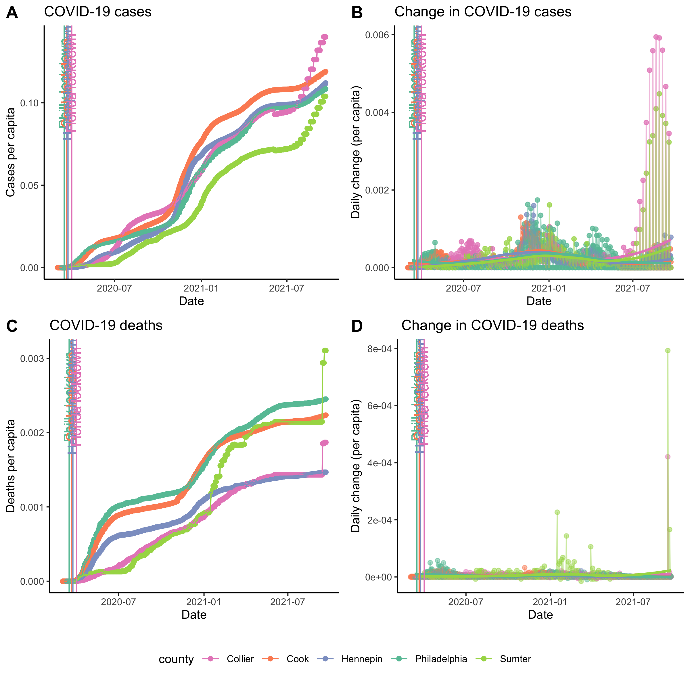
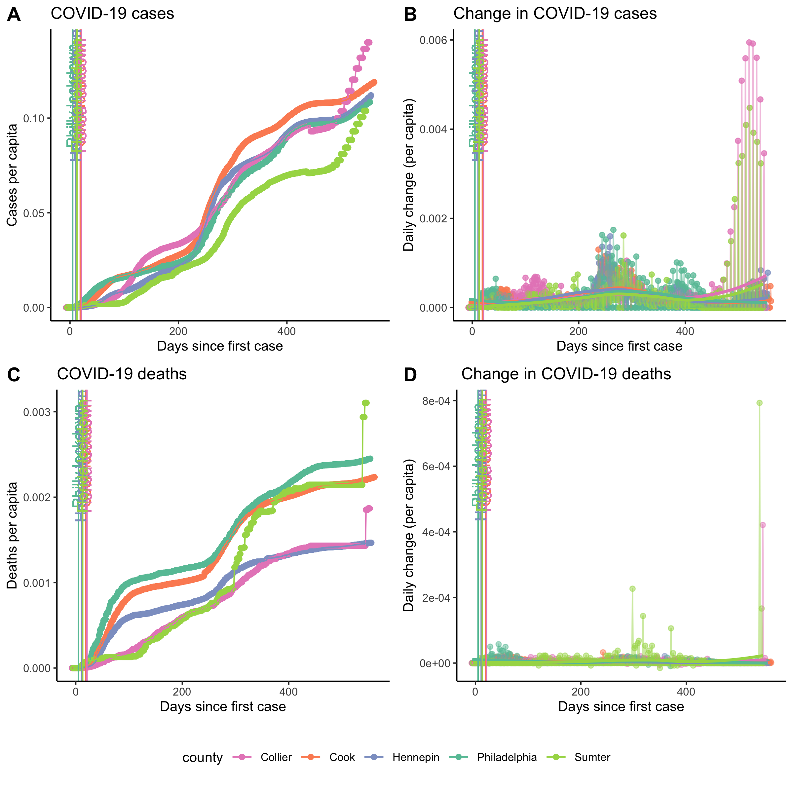
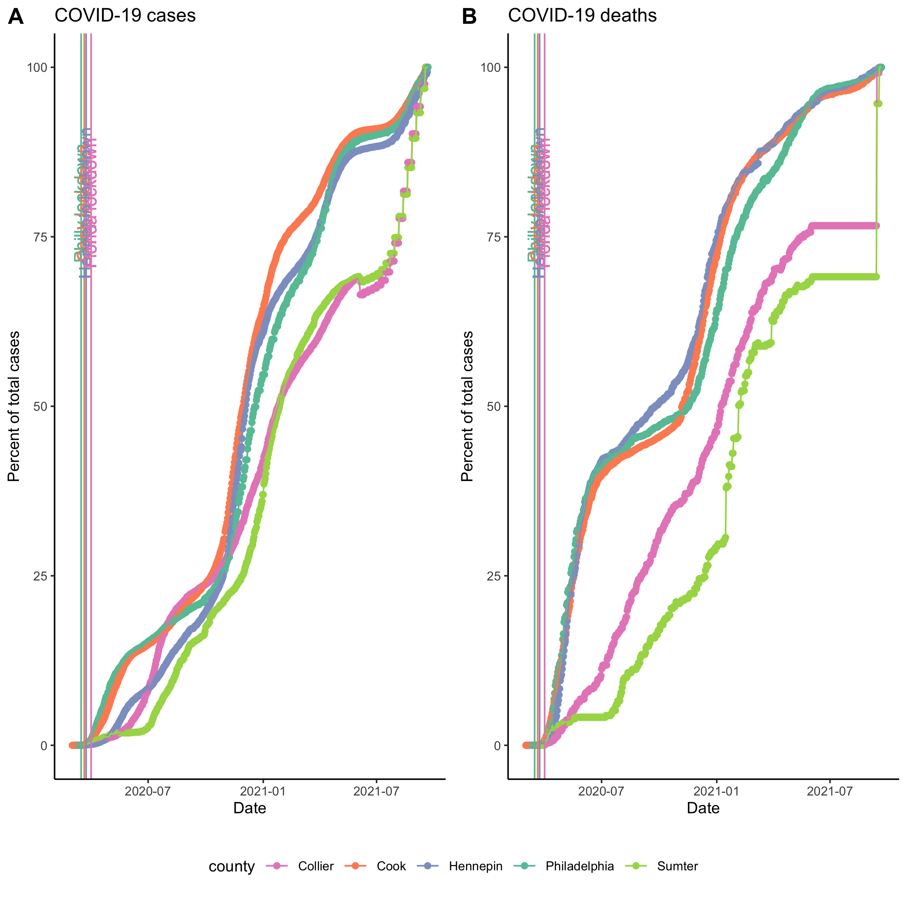

## COVID-19 daily progression

Data for all US counties are pulled daily from the nytimes github repository: https://github.com/nytimes/covid-19-data. 
Below, I plot the daily progression of cases per capita and the daily change in cases per capita for the following counties:  
1. Philly (me)  
2. Cook (Ben)  
3. Hennepin (Sydney)  
4. Collier (Mom and Larry)  
5. Sumter (Bonnie's parents)  

```{r setup, include=FALSE, warning=FALSE}
library(tidyverse)
library(cowplot)
library(scales)
library(lubridate)
library(gganimate)
library(gifski)
library(png)
theme_set(theme_classic(base_size = 10))
setwd('/Users/larsenb/Documents/BenProjects/covid19/')
```


```{r prepare data, echo=FALSE, warning=FALSE}
covid_data <- read.csv('/Users/larsenb/Documents/BenProjects/covid19/covid-19-data/us-counties.csv')
covid_data$date<-as.Date(covid_data$date)
population_data <- read.csv('co-est2019-alldata.csv')
population_data$CTYNAME <- str_replace(population_data$CTYNAME," County","")
covid_data <- covid_data %>% left_join(population_data %>% select(STNAME,CTYNAME,POPESTIMATE2019),by = c("state"="STNAME","county" = "CTYNAME"))
covid_data$population <- covid_data$POPESTIMATE2019

covid_data <- covid_data %>%
  filter(!(county=="Cook" & state != "Illinois")) %>% 
  filter(!(county == "Sumter"&state != "Florida")) %>%
  filter(county %in% c("Philadelphia","Cook","Hennepin","Collier","Sumter")) %>%
  filter(date > as.Date("2020-02-29"))

# Print date
recent_date = max(covid_data$date)
cat(sprintf("\nMost recent data: %s\n",recent_date))

philly_color = "#66c2a5"
cook_color = "#fc8d62"
hennepin_color = "#8da0cb"
collier_color = "#e78ac3"
sumter_color = "#a6d854"

pop_summary <- covid_data %>%
  group_by(state,county)%>%
  summarize(population = mean(population,na.rm=T))
ggplot(data=pop_summary,aes(x = reorder(county,-population), y = population, fill = county)) +
  geom_bar(stat = "identity") + scale_y_continuous(labels = comma) +
  scale_fill_manual(values = c(collier_color,cook_color,hennepin_color,philly_color,sumter_color)) +
  ylab("Population") + xlab("County") + ggtitle("Population of each county")

covid_data <- covid_data %>%
  mutate(cases_per_capita = cases/population) %>%
  mutate(deaths_per_capita = deaths/population)
  

philly_lockdown <- as.Date("2020-03-16")
cook_lockdown <- as.Date("2020-03-21")
hennepin_lockdown <- as.Date("2020-03-24")
florida_lockdown <- as.Date("2020-04-01")

drv <- function(x) c(NA, diff(x))
case_threshold <- 10 #Controls when to start counting days
first_date <- function(x,y) min(x[y>=case_threshold],na.rm=T)

covid_data <- covid_data %>%
  group_by(county) %>%
  mutate(daily_change = drv(cases_per_capita)) %>%
  mutate(daily_change_deaths = drv(deaths_per_capita)) %>%
  mutate(days_since_first_case = as.numeric(date - first_date(date,cases)))%>%
  mutate(case_percent = (cases/max(cases,na.rm=T))*100)%>%
  mutate(death_percent = (deaths/max(deaths,na.rm = T))*100)%>%
  filter(daily_change>=0)

d1s <- covid_data %>% summarise(mind = min(date))
philly_lockdown_days <- as.numeric(philly_lockdown - d1s$mind[d1s$county=="Philadelphia"])
cook_lockdown_days <- as.numeric(cook_lockdown - d1s$mind[d1s$county=="Cook"])
hennepin_lockdown_days <- as.numeric(hennepin_lockdown - d1s$mind[d1s$county=="Hennepin"])
collier_lockdown_days <- as.numeric(florida_lockdown - d1s$mind[d1s$county=="Collier"])
sumter_lockdown_days <- as.numeric(florida_lockdown - d1s$mind[d1s$county=="Sumter"])
```

```{r plots, warning=FALSE,echo=FALSE}

cases <- ggplot(data = covid_data,aes(x=date,y=cases_per_capita,fill=county,color = county)) +
  geom_point() + geom_line() +
  scale_color_manual(values = c(collier_color,cook_color,hennepin_color,philly_color,sumter_color)) +
  geom_vline(xintercept = philly_lockdown,color=philly_color,show.legend = T) + 
  geom_text(aes(x=philly_lockdown-1, y=.8*max(cases_per_capita),label="Philly lockdown"), 
            colour=philly_color, angle=90) +
  geom_vline(xintercept = cook_lockdown,color = cook_color) + 
  geom_text(aes(x=cook_lockdown-1, y=.8*max(cases_per_capita),label="Cook lockdown"), 
            colour=cook_color, angle=90) +
  geom_vline(xintercept = hennepin_lockdown,color = hennepin_color) +
  geom_text(aes(x=hennepin_lockdown-1, y=.8*max(cases_per_capita),label="Hennepin lockdown"), 
            colour=hennepin_color, angle=90) +
  geom_vline(xintercept = florida_lockdown,color = collier_color) +
  geom_text(aes(x=florida_lockdown-1, y=.8*max(cases_per_capita),label="Florida lockdown"), 
            colour=collier_color, angle=90) +
  labs(y = "Cases per capita",x="Date",title = "COVID-19 cases")


dtCases <- ggplot(data = covid_data,aes(x=date,y=daily_change,color = county)) +
  geom_point(alpha = .75) + geom_line(alpha = .5) + geom_smooth(method = "loess",formula = "y ~x",se = F) +
  scale_color_manual(values = c(collier_color,cook_color,hennepin_color,philly_color,sumter_color)) +
  geom_vline(xintercept = philly_lockdown,color=philly_color,show.legend = T) + 
  geom_text(aes(x=philly_lockdown-1, y=.8*max(daily_change,na.rm = T),label="Philly lockdown"), 
            colour=philly_color, angle=90) +
  geom_vline(xintercept = cook_lockdown,color = cook_color) + 
  geom_text(aes(x=cook_lockdown-1, y=.8*max(daily_change,na.rm = T),label="Cook lockdown"), 
            colour=cook_color, angle=90) +
  geom_vline(xintercept = hennepin_lockdown,color = hennepin_color) +
  geom_text(aes(x=hennepin_lockdown-1, y=.8*max(daily_change,na.rm = T),label="Hennepin lockdown"), 
            colour=hennepin_color, angle=90) +
  geom_vline(xintercept = florida_lockdown,color = collier_color) +
  geom_text(aes(x=florida_lockdown-1, y=.8*max(daily_change,na.rm = T),label="Florida lockdown"), 
            colour=collier_color, angle=90) +
  labs(y = "Daily change (per capita)",x="Date",title = "Change in COVID-19 cases")

deaths <- ggplot(data = covid_data,aes(x=date,y=deaths_per_capita,fill=county,color = county)) +
  geom_point() + geom_line() +
  scale_color_manual(values = c(collier_color,cook_color,hennepin_color,philly_color,sumter_color)) +
  geom_vline(xintercept = philly_lockdown,color=philly_color,show.legend = T) + 
  geom_text(aes(x=philly_lockdown-1, y=.8*max(deaths_per_capita),label="Philly lockdown"), 
            colour=philly_color, angle=90) +
  geom_vline(xintercept = cook_lockdown,color = cook_color) + 
  geom_text(aes(x=cook_lockdown-1, y=.8*max(deaths_per_capita),label="Cook lockdown"), 
            colour=cook_color, angle=90) +
  geom_vline(xintercept = hennepin_lockdown,color = hennepin_color) +
  geom_text(aes(x=hennepin_lockdown-1, y=.8*max(deaths_per_capita),label="Hennepin lockdown"), 
            colour=hennepin_color, angle=90) +
  geom_vline(xintercept = florida_lockdown,color = collier_color) +
  geom_text(aes(x=florida_lockdown-1, y=.8*max(deaths_per_capita),label="Florida lockdown"), 
            colour=collier_color, angle=90) +
  labs(y = "Deaths per capita",x="Date",title = "COVID-19 deaths")


dtDeaths <- ggplot(data = covid_data,aes(x=date,y=daily_change_deaths,color = county)) +
  geom_point(alpha = .5) + geom_line(alpha = .5) + geom_smooth(method = "loess",formula = "y ~x",se = F) +
  scale_color_manual(values = c(collier_color,cook_color,hennepin_color,philly_color,sumter_color)) +
  geom_vline(xintercept = philly_lockdown,color=philly_color,show.legend = T) + 
  geom_text(aes(x=philly_lockdown-1, y=.8*max(daily_change_deaths,na.rm = T),label="Philly lockdown"), 
            colour=philly_color, angle=90) +
  geom_vline(xintercept = cook_lockdown,color = cook_color) + 
  geom_text(aes(x=cook_lockdown-1, y=.8*max(daily_change_deaths,na.rm = T),label="Cook lockdown"), 
            colour=cook_color, angle=90) +
  geom_vline(xintercept = hennepin_lockdown,color = hennepin_color) +
  geom_text(aes(x=hennepin_lockdown-1, y=.8*max(daily_change_deaths,na.rm = T),label="Hennepin lockdown"), 
            colour=hennepin_color, angle=90) +
  geom_vline(xintercept = florida_lockdown,color = collier_color) +
  geom_text(aes(x=florida_lockdown-1, y=.8*max(daily_change_deaths,na.rm = T),label="Florida lockdown"), 
            colour=collier_color, angle=90) +
  labs(y = "Daily change (per capita)",x="Date",title = " Change in COVID-19 deaths")
  

# compile into one figure
combo_plot <- cowplot::plot_grid(
  cases +  theme(legend.position="none"), 
  dtCases + theme(legend.position="none"), 
  deaths + theme(legend.position="none"), 
  dtDeaths + theme(legend.position="none"), 
  labels = "AUTO",nrow = 2)

county_legend <- cowplot::get_legend(
  cases + 
    guides(color = guide_legend(nrow = 1)) +
    theme(legend.position = "bottom")
)

combo_plot <- plot_grid(combo_plot, county_legend, ncol = 1, rel_heights = c(1, .1))

cowplot::save_plot(filename = "covid_plot.png",plot = combo_plot,base_height = 8, base_width = 8)

```

### Cool video :)
Animation of cases per capita.  
```{r animation,echo=FALSE,message=FALSE}
anim <- cases + transition_reveal(date)
anim_save("/Users/larsenb/Documents/BenProjects/covid19/cases_animation.gif",animation = anim,renderer = gifski_renderer())
knitr::include_graphics("/Users/larsenb/Documents/BenProjects/covid19/cases_animation.gif")
```

## Looking by date of 10 cases
Now the same curves are plotted as a function of days since case count reached 10 cases, rather than date. 

```{r first_case, echo=FALSE,warning=FALSE,message=FALSE}
cases <- ggplot(data = covid_data,aes(x=days_since_first_case,y=cases_per_capita,fill=county,color = county)) +
  geom_point() + geom_line() +
  scale_color_manual(values = c(collier_color,cook_color,hennepin_color,philly_color,sumter_color)) +
  geom_vline(xintercept = philly_lockdown_days,color=philly_color,show.legend = T) + 
  geom_text(aes(x=philly_lockdown_days-1, y=.8*max(cases_per_capita),label="Philly lockdown"), 
            colour=philly_color, angle=90) +
  geom_vline(xintercept = cook_lockdown_days,color = cook_color) + 
  geom_text(aes(x=cook_lockdown_days-1, y=.8*max(cases_per_capita),label="Cook lockdown"), 
            colour=cook_color, angle=90) +
  geom_vline(xintercept = hennepin_lockdown_days,color = hennepin_color) +
  geom_text(aes(x=hennepin_lockdown_days-1, y=.8*max(cases_per_capita),label="Hennepin lockdown"), 
            colour=hennepin_color, angle=90) +
  geom_vline(xintercept = collier_lockdown_days,color = collier_color) +
  geom_text(aes(x=collier_lockdown_days-1, y=.8*max(cases_per_capita),label="Florida lockdown"), 
            colour=collier_color, angle=90) +
  geom_vline(xintercept = sumter_lockdown_days,color = sumter_color) +
  geom_text(aes(x=sumter_lockdown_days-1, y=.8*max(cases_per_capita),label="Florida lockdown"), 
            colour=sumter_color, angle=90) +
  labs(y = "Cases per capita",x="Days since first case",title = "COVID-19 cases")


dtCases <- ggplot(data = covid_data,aes(x=days_since_first_case,y=daily_change,color = county)) +
  geom_point(alpha = .75) + geom_line(alpha = .5) + geom_smooth(method = "loess",formula = "y ~x",se = F) +
  scale_color_manual(values = c(collier_color,cook_color,hennepin_color,philly_color,sumter_color)) +
  geom_vline(xintercept = philly_lockdown_days,color=philly_color,show.legend = T) + 
  geom_text(aes(x=philly_lockdown_days-1, y=.8*max(daily_change,na.rm = T),label="Philly lockdown"), 
            colour=philly_color, angle=90) +
  geom_vline(xintercept = cook_lockdown_days,color = cook_color) + 
  geom_text(aes(x=cook_lockdown_days-1, y=.8*max(daily_change,na.rm = T),label="Cook lockdown"), 
            colour=cook_color, angle=90) +
  geom_vline(xintercept = hennepin_lockdown_days,color = hennepin_color) +
  geom_text(aes(x=hennepin_lockdown_days-1, y=.8*max(daily_change,na.rm = T),label="Hennepin lockdown"), 
            colour=hennepin_color, angle=90) +
  geom_vline(xintercept = collier_lockdown_days,color = collier_color) +
  geom_text(aes(x=collier_lockdown_days-1, y=.8*max(daily_change,na.rm = T),label="Florida lockdown"), 
            colour=collier_color, angle=90) +
  geom_vline(xintercept = sumter_lockdown_days,color = sumter_color) +
  geom_text(aes(x=sumter_lockdown_days-1, y=.8*max(daily_change,na.rm = T),label="Florida lockdown"), 
            colour=sumter_color, angle=90) +
  labs(y = "Daily change (per capita)",x="Days since first case",title = "Change in COVID-19 cases")

deaths <- ggplot(data = covid_data,aes(x=days_since_first_case,y=deaths_per_capita,fill=county,color = county)) +
  geom_point() + geom_line() +
  scale_color_manual(values = c(collier_color,cook_color,hennepin_color,philly_color,sumter_color)) +
  geom_vline(xintercept = philly_lockdown_days,color=philly_color,show.legend = T) + 
  geom_text(aes(x=philly_lockdown_days-1, y=.8*max(deaths_per_capita),label="Philly lockdown"), 
            colour=philly_color, angle=90) +
  geom_vline(xintercept = cook_lockdown_days,color = cook_color) + 
  geom_text(aes(x=cook_lockdown_days-1, y=.8*max(deaths_per_capita),label="Cook lockdown"), 
            colour=cook_color, angle=90) +
  geom_vline(xintercept = hennepin_lockdown_days,color = hennepin_color) +
  geom_text(aes(x=hennepin_lockdown_days-1, y=.8*max(deaths_per_capita),label="Hennepin lockdown"), 
            colour=hennepin_color, angle=90) +
  geom_vline(xintercept = collier_lockdown_days,color = collier_color) +
  geom_text(aes(x=collier_lockdown_days-1, y=.8*max(deaths_per_capita),label="Florida lockdown"), 
            colour=collier_color, angle=90) +
  geom_vline(xintercept = sumter_lockdown_days,color = sumter_color) +
  geom_text(aes(x=sumter_lockdown_days-1, y=.8*max(deaths_per_capita),label="Florida lockdown"), 
            colour=sumter_color, angle=90) +
  labs(y = "Deaths per capita",x="Days since first case",title = "COVID-19 deaths")


dtDeaths <- ggplot(data = covid_data,aes(x=days_since_first_case,y=daily_change_deaths,color = county)) +
  geom_point(alpha = .5) + geom_line(alpha = .5) + geom_smooth(method = "loess",formula = "y~x",se = F) +
  scale_color_manual(values = c(collier_color,cook_color,hennepin_color,philly_color,sumter_color)) +
  geom_vline(xintercept = philly_lockdown_days,color=philly_color,show.legend = T) + 
  geom_text(aes(x=philly_lockdown_days-1, y=.8*max(daily_change_deaths,na.rm = T),label="Philly lockdown"), 
            colour=philly_color, angle=90) +
  geom_vline(xintercept = cook_lockdown_days,color = cook_color) + 
  geom_text(aes(x=cook_lockdown_days-1, y=.8*max(daily_change_deaths,na.rm = T),label="Cook lockdown"), 
            colour=cook_color, angle=90) +
  geom_vline(xintercept = hennepin_lockdown_days,color = hennepin_color) +
  geom_text(aes(x=hennepin_lockdown_days-1, y=.8*max(daily_change_deaths,na.rm = T),label="Hennepin lockdown"), 
            colour=hennepin_color, angle=90) +
  geom_vline(xintercept = collier_lockdown_days,color = collier_color) +
  geom_text(aes(x=collier_lockdown_days-1, y=.8*max(daily_change_deaths,na.rm = T),label="Florida lockdown"), 
            colour=collier_color, angle=90) +
  geom_vline(xintercept = sumter_lockdown_days,color = sumter_color) +
  geom_text(aes(x=sumter_lockdown_days-1, y=.8*max(daily_change_deaths,na.rm = T),label="Florida lockdown"), 
            colour=sumter_color, angle=90) +
  labs(y = "Daily change (per capita)",x="Days since first case",title = " Change in COVID-19 deaths")
  

# compile into one figure
combo_plot <- cowplot::plot_grid(
  cases +  theme(legend.position="none"), 
  dtCases + theme(legend.position="none"), 
  deaths + theme(legend.position="none"), 
  dtDeaths + theme(legend.position="none"), 
  labels = "AUTO",nrow = 2)

county_legend <- cowplot::get_legend(
  cases + 
    guides(color = guide_legend(nrow = 1)) +
    theme(legend.position = "bottom")
)

combo_plot <- plot_grid(combo_plot, county_legend, ncol = 1, rel_heights = c(1, .1))

cowplot::save_plot(filename = "covid_plot_2.png",plot = combo_plot,base_height = 8, base_width = 8)


 ## animate
anim <- cases + transition_reveal(days_since_first_case)
anim_save("/Users/larsenb/Documents/BenProjects/covid19/cases_animation2.gif",animation = anim,renderer = gifski_renderer())
knitr::include_graphics("/Users/larsenb/Documents/BenProjects/covid19/cases_animation2.gif")

anim <- deaths + transition_reveal(days_since_first_case)
anim_save("/Users/larsenb/Documents/BenProjects/covid19/deaths_animation2.gif",animation = anim,renderer = gifski_renderer())
knitr::include_graphics("/Users/larsenb/Documents/BenProjects/covid19/deaths_animation2.gif")

```

## Normalized by max cases


```{r max_case, echo=FALSE,warning=FALSE,message=FALSE}
cases <- ggplot(data = covid_data,aes(x=date,y=case_percent,fill=county,color = county)) +
  geom_point() + geom_line() +
  scale_color_manual(values = c(collier_color,cook_color,hennepin_color,philly_color,sumter_color)) +
  geom_vline(xintercept = philly_lockdown,color=philly_color,show.legend = T) + 
  geom_text(aes(x=philly_lockdown-1, y=.8*max(case_percent),label="Philly lockdown"), 
            colour=philly_color, angle=90) +
  geom_vline(xintercept = cook_lockdown,color = cook_color) + 
  geom_text(aes(x=cook_lockdown-1, y=.8*max(case_percent),label="Cook lockdown"), 
            colour=cook_color, angle=90) +
  geom_vline(xintercept = hennepin_lockdown,color = hennepin_color) +
  geom_text(aes(x=hennepin_lockdown-1, y=.8*max(case_percent),label="Hennepin lockdown"), 
            colour=hennepin_color, angle=90) +
  geom_vline(xintercept = florida_lockdown,color = collier_color) +
  geom_text(aes(x=florida_lockdown-1, y=.8*max(case_percent),label="Florida lockdown"), 
            colour=collier_color, angle=90) +
  labs(y = "Percent of total cases",x="Date",title = "COVID-19 cases")

deaths <- ggplot(data = covid_data,aes(x=date,y=death_percent,fill=county,color = county)) +
  geom_point() + geom_line() +
  scale_color_manual(values = c(collier_color,cook_color,hennepin_color,philly_color,sumter_color)) +
  geom_vline(xintercept = philly_lockdown,color=philly_color,show.legend = T) + 
  geom_text(aes(x=philly_lockdown-1, y=.8*max(death_percent),label="Philly lockdown"), 
            colour=philly_color, angle=90) +
  geom_vline(xintercept = cook_lockdown,color = cook_color) + 
  geom_text(aes(x=cook_lockdown-1, y=.8*max(death_percent),label="Cook lockdown"), 
            colour=cook_color, angle=90) +
  geom_vline(xintercept = hennepin_lockdown,color = hennepin_color) +
  geom_text(aes(x=hennepin_lockdown-1, y=.8*max(death_percent),label="Hennepin lockdown"), 
            colour=hennepin_color, angle=90) +
  geom_vline(xintercept = florida_lockdown,color = collier_color) +
  geom_text(aes(x=florida_lockdown-1, y=.8*max(death_percent),label="Florida lockdown"), 
            colour=collier_color, angle=90) +
  labs(y = "Percent of total cases",x="Date",title = "COVID-19 deaths")


# compile into one figure
combo_plot <- cowplot::plot_grid(
  cases +  theme(legend.position="none"), 
  deaths + theme(legend.position="none"),  
  labels = "AUTO",nrow = 1)

county_legend <- cowplot::get_legend(
  cases + 
    guides(color = guide_legend(nrow = 1)) +
    theme(legend.position = "bottom")
)

combo_plot <- plot_grid(combo_plot, county_legend, rel_heights = c(1, .1),ncol = 1)

cowplot::save_plot(filename = "covid_plot_3.png",plot = combo_plot,base_height = 8, base_width = 8)


 ## animate
anim <- cases + transition_reveal(date)
anim_save("/Users/larsenb/Documents/BenProjects/covid19/cases_animation3.gif",animation = anim,renderer = gifski_renderer())
knitr::include_graphics("/Users/larsenb/Documents/BenProjects/covid19/cases_animation3.gif")

anim <- deaths + transition_reveal(date)
anim_save("/Users/larsenb/Documents/BenProjects/covid19/deaths_animation3.gif",animation = anim,renderer = gifski_renderer())
knitr::include_graphics("/Users/larsenb/Documents/BenProjects/covid19/deaths_animation3.gif")

```
